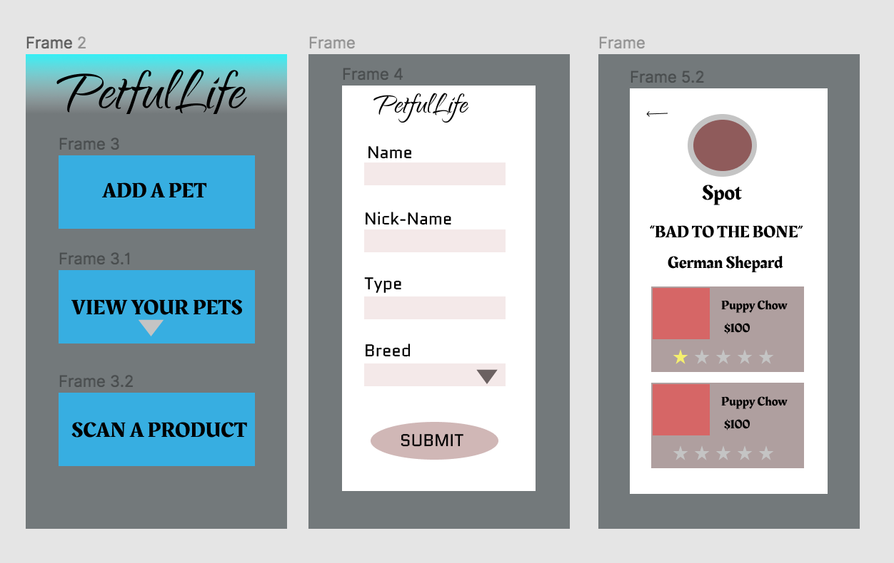

# PetfulLife

## Description

PetfulLife is an app submitted as a final cross pollination project at Turing. It uses a front-end and back-end and allows a user to track the products their pet uses. A user can create and save a pet to create a pet profile. A user can also scan/save/rate products to a specific pet, or view all products you use for any of your pets. 
  
 You can view the Back-End Repository [here](https://github.com/petful-life/PetfulLife_API.git).

## Installation
  #### 1. Install the Expo mobile app
  [iOS](https://apps.apple.com/app/apple-store/id982107779)
  
  #### 2. Globally install Expo CLI
  ```npm install -g expo-cli```
  
  #### 3. Clone down this repo and cd in to it
  ```git clone https://github.com/petful-life/petfulLife.git```
  #### 4. Run npm install
  ```npm install```
  #### 5. Run the server
  ```npm start```
  #### 6. Open App in Expo
  *Make sure your mobile device and server are running on the same internet connection*
  
  Use your camera to scan the QR code presented to you on Expo
  
 ## Wireframes
 
 
## Contributors

[Adam Niedzwiecki](https://github.com/AdamN8142)

[Lauren Boyer](https://github.com/lboyer4)

[Vincent Provenzano](https://github.com/Vjp888)

[Jeremy Bennett](https://github.com/jaxjafinpapau)

